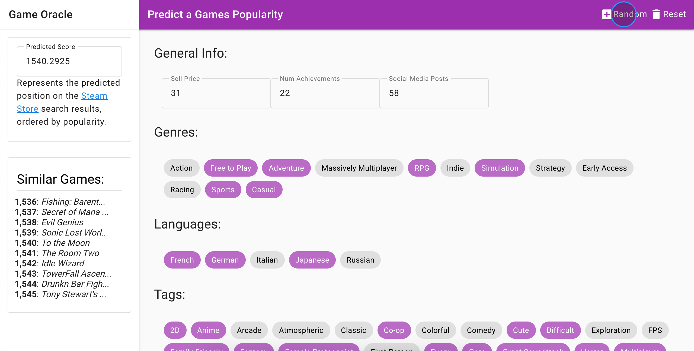
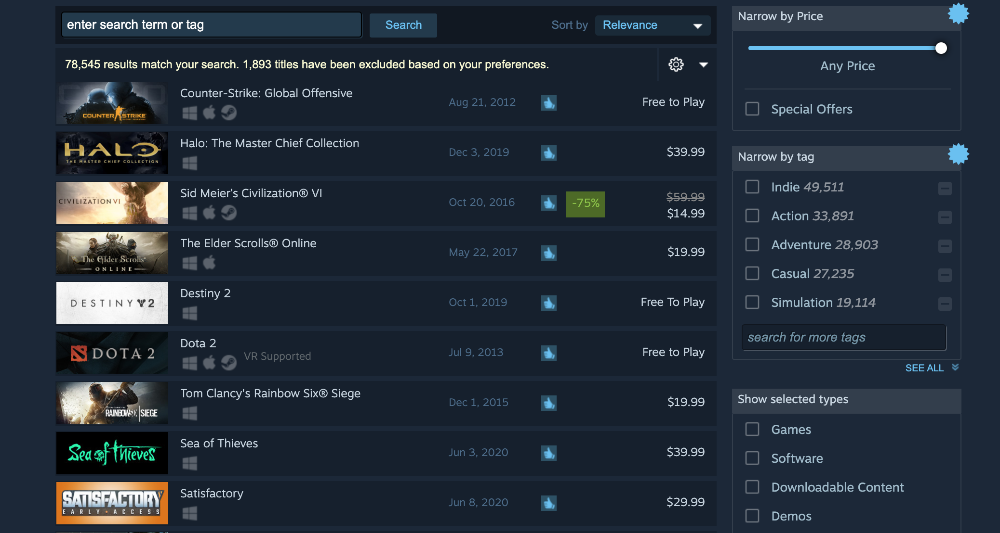
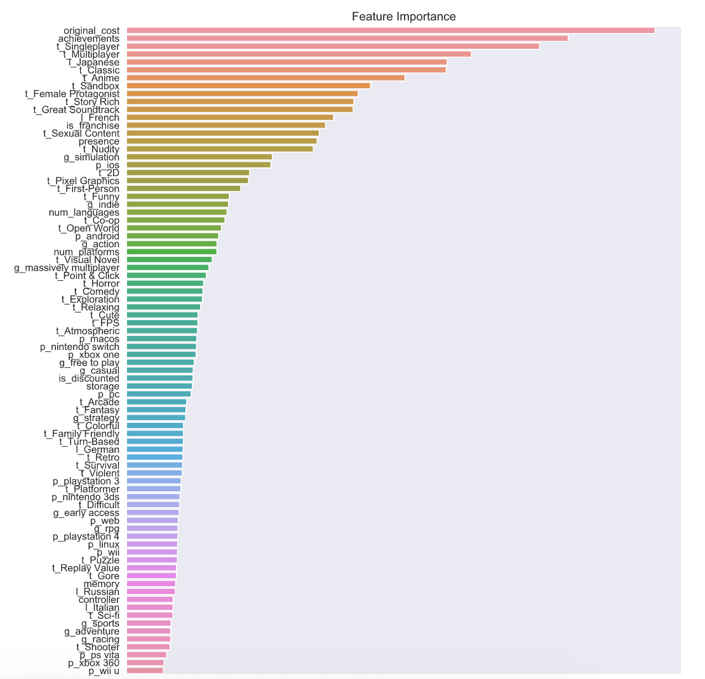
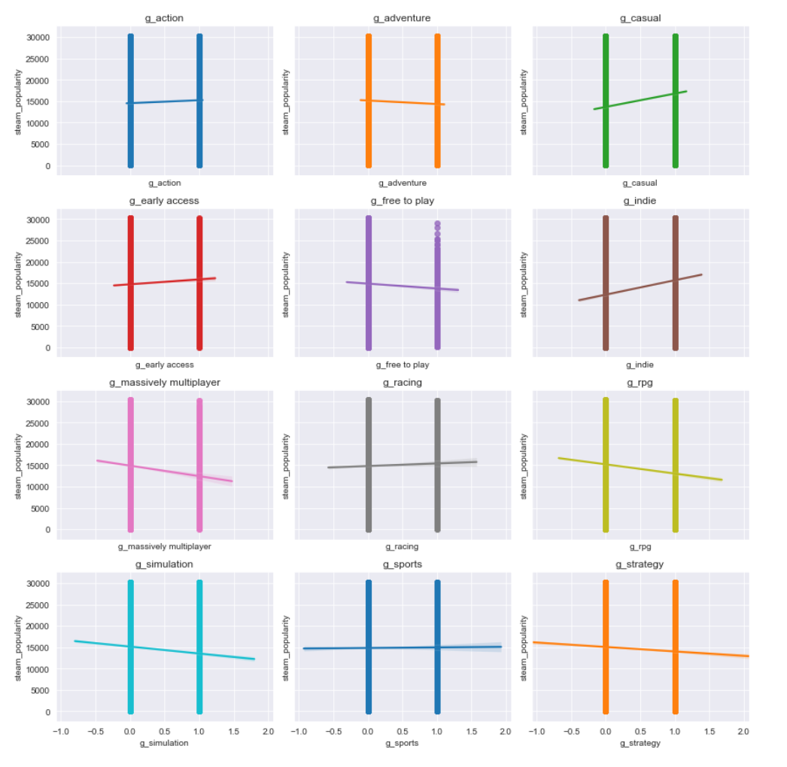
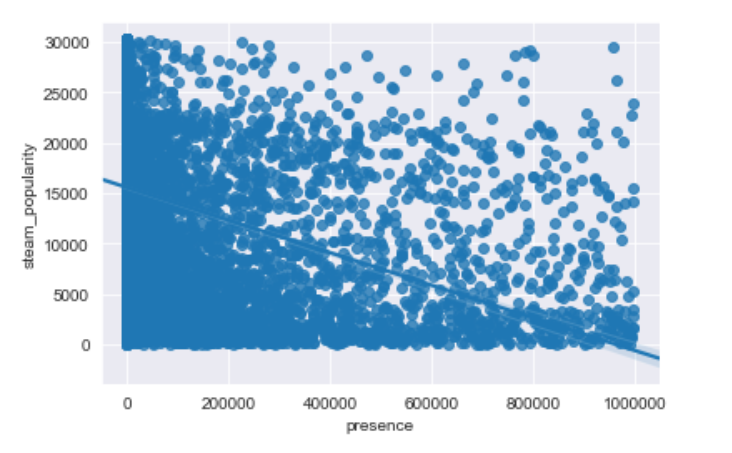

# Game Oracle

## About

### Predict the success of a game before investing time on development

The most difficult part of creating a video game is coming up with a valuable idea. All to often the developer focuses on creating something that is interesting only to them, spending months or years developing a unprofitable game design.

Predictions are created using Machine Learning models trained on data gathered from two main sources: the Steam Store, and the RAWG gaming site API.

The metric for a succesful game is based on the rank of the game and what place it appears on the Steam Store when sorting all games by popularity.

We can see the top spots are dominated by very succesful, familiar games.

## App

The completed app is hosted on Heroku:

[https://game-oracle-ui.herokuapp.com/](https://game-oracle-ui.herokuapp.com/)

## Data

### Download

The complete dataset used in this project is hosted on Kaggle.com and is free to use:

[https://www.kaggle.com/jesneuman/pc-games](https://www.kaggle.com/jesneuman/pc-games)

### Blog

Outlines and explains the entire process for obtaining and saving the data:

[https://medium.com/@Jesse989/creating-a-dataset-from-scratch-b8e2f8752436](https://medium.com/@Jesse989/creating-a-dataset-from-scratch-b8e2f8752436)

## API

### Blog

Walks through the process of creating a Flask server using python, which is used to serve ML predictions to the user-interface:

[https://towardsdatascience.com/serve-predictions-from-an-api-1d84b4ac9a7c](https://towardsdatascience.com/serve-predictions-from-an-api-1d84b4ac9a7c)

## Presentation

### Online Non-technical Presentation

Walks the shareholder through the project, discussing methodology, business insights, and further work.

[https://spark.adobe.com/page/SBuLbrBv3VUqc/](https://spark.adobe.com/page/SBuLbrBv3VUqc/)

## Project Organization

------------

    ├── LICENSE
    ├── README.md          <- The top-level README for developers using this project.
    ├── data
    │   ├── interim        <- Intermediate data that has been transformed.
    │   ├── processed      <- The final, canonical data sets for modeling.
    │   └── raw            <- The original, immutable data dump.
    │
    ├── models             <- Trained and serialized models
    │
    ├── notebooks          <- Jupyter notebooks. Naming convention is a number (for ordering),
    │                         the creator's initials, and a short `-` delimited description, e.g.
    │                         `1.0-jqp-initial-data-exploration`.
    │
    ├── references         <- Data dictionaries, manuals, and all other explanatory materials.
    │
    ├── requirements.txt   <- The requirements file for reproducing the analysis environment, e.g.
    │                         generated with `pip freeze > requirements.txt`
    │
    ├── src                <- Source code for use in this project.
    │   │
    │   └── data           <- Scripts to download or generate data
    │       └── build_dataset.py
    │
    └── tox.ini            <- tox file with settings for running tox; see tox.readthedocs.io

------------

## Visualizations

### Which Features are most Important:

## Model Evaluation

During this project I worked with two different models. The first was a classic Linear Regression model, and the second was a XGBoost regression model.

The XGBoost model outperformed the Linear Regression substantially, with the Linear Regression achieving a R2 of .42, and the XGBoost achieving a score of .53.

## Recommendations

1. Do not make an 'Indie' game. When I started this project I was very interested in how 'Indie' games compared to games made by large gaming studios. I was surprised to see how much a game's predicted popularity drops when it is tagged as an 'Indie' game.

From this plot we can see the best genres to target would be 'RPG', 'Massively Multiplayer', and 'Simulation'.

2. We can see from the feature importance graph that  eastern influences are extremely popular when it comes to video game design. One of the best ways to boost the popularity of a game design is to infuse it with elements from Anime, and to give it Japanese language support.

3. Having a large number of reviews is a better indicator of popularity than having a few 'great' reviews. This can be explained as the 'any press is good press' and a large amount of 'negative' reviews also indicates the game is popular enough to want to leave a review for.

## Conclusion and Future Work

Overall this project was very exciting to work on, and led to some valuable insights and learning opportunities.

If I had more time there are several things I would focus on.

First of all, I would like to gather a few more very strong indicators, in order to get my model accuracy higher.

In addition, there are several features that could be added to the web app, and as of now it doesn't have a way to indicate all of the features that are used by the model for predictions.

Finally, it would be nice to have an option that would display all of the information from the app in pdf format, so once you find a game design that appears promising you can have a print out of the configuration.